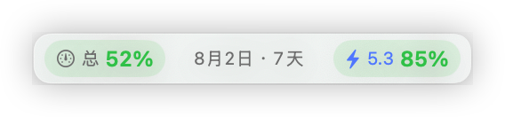

# Codex 算力条

一个开源的 macOS Codex 桌面伴随面板。它贴靠在 Codex 主窗口顶部，用紧凑状态条显示账户剩余用量、GPT-5.3 单独额度，以及当天最近活跃项目的本地 Token 统计。

> 非官方项目，与 OpenAI 无隶属或背书关系。Codex、ChatGPT 等名称归其各自权利人所有。



## 功能

- 顶部紧凑显示：`总 31% · 7月25日 · 4天 │ 5.3 86%`。
- 总额度和 GPT-5.3 百分比分别按绿、黄、红显示剩余状态。
- 使用原生半透明玻璃卡片、状态胶囊和进度条区分关键信息。
- 左键只用于拖动，不会展开详情。
- 右键可查看当天最近活跃的 5 个项目、完整额度、恢复默认位置或退出。
- 项目详情显示总 Token、轮次、平均 Token、最后活动时间；悬停可看输入、输出、推理与缓存 Token。
- Codex 窗口离开前台、隐藏或最小化时，面板自动隐藏。
- 无法读取额度时显示灰色 `—`，不会用其他模型额度冒充 GPT-5.3 数据。

## 运行要求

- macOS 13 或更高版本。
- 已安装并登录 Codex 桌面客户端，或本机存在可用的 Codex CLI。
- Xcode Command Line Tools 与 Swift 6，用于从源码构建。
- 当前已在 Apple Silicon Mac 上验证；Intel Mac 尚未实机验证。

## 快速安装

```bash
git clone https://github.com/yidiandianzheng/Codex.git
cd Codex
swift run CodexPetEnergy --self-test
./scripts/install-app.sh
open "$HOME/Applications/Codex算力条.app"
```

应用没有 Dock 图标。Codex 主窗口位于前台时，算力条会自动出现；默认不会设置登录自动启动。

更完整的安装、交互、登录启动和故障排查见：[使用说明](docs/使用说明.md)。

## 显示规则

- 百分比表示剩余用量：`100 - usedPercent`。
- 日期表示整体额度的重置日期。
- 天数表示距离重置时间还剩多少个 24 小时，向上取整。
- 50%–100% 为绿色，20%–49% 为黄色，0%–19% 为红色。
- `5.3` 使用蓝色文字作为明确模型标记；颜色不是唯一识别方式。
- 顶部状态条位于账号名称和帮助按钮之间的留白区，并在可用区域中居中。

## 隐私与数据

- 项目没有遥测、广告或自行上传数据的代码。
- 账户额度通过本机 Codex `app-server` 读取。
- 项目 Token 统计只在本机解析 `~/.codex/sessions` 与 `~/.codex/archived_sessions`。
- 解析时只提取项目目录、Token 数量和活动时间；不会把会话内容写入本项目或发送给项目维护者。

详情见：[隐私与数据说明](docs/隐私与数据.md)。

## 开发与验证

```bash
swift run CodexPetEnergy --self-test
swift build -c release
```

项目不依赖第三方 Swift 包。核心验证覆盖额度桶合并、GPT-5.3 紧凑状态、右键详情、布局、项目统计与位置持久化。

## 建议与反馈

- 遇到错误：[提交错误报告](https://github.com/yidiandianzheng/Codex/issues/new?template=bug_report.yml)
- 想要新功能：[提交功能建议](https://github.com/yidiandianzheng/Codex/issues/new?template=feature_request.yml)
- 使用交流、开放讨论：[进入讨论区](https://github.com/yidiandianzheng/Codex/discussions)

提交前请先搜索是否已有相同内容。贡献流程见：[贡献说明](CONTRIBUTING.md)。

## 开源许可

[MIT 开源许可](LICENSE)
